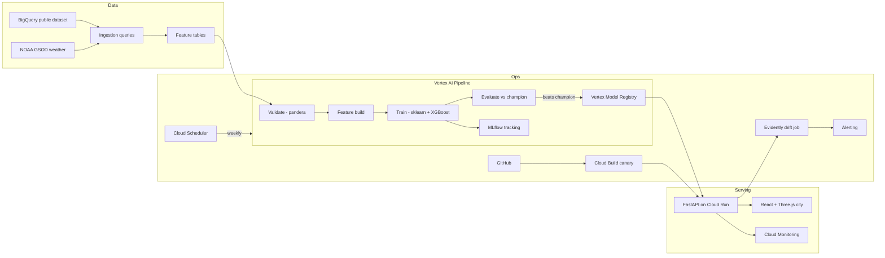

# pedal-cast

Hourly bike-share demand forecasting per station zone on GCP.

Predict trip starts for the next hour, serve them from a public REST API, and run an automated train → evaluate → register → deploy → monitor → retrain loop. Built as a portfolio MLOps system (scikit-learn, XGBoost, MLflow, Vertex AI, Terraform, canary deploys, drift monitoring), not a notebook dump.

**Status:** Week 0 foundation. Nothing is deployed yet. Source data is Austin Bikeshare with simulated `T_NOW` = 2024-05-05 UTC; see [docs/architecture.md](docs/architecture.md) §2. Demo URL and screenshots land when serving is up.

---

## What it does

1. Pulls trips (and weather) from a BigQuery public dataset.
2. Aggregates to hourly demand per station zone.
3. Trains an sklearn + XGBoost model with time-based splits and a coded promotion rule.
4. Serves `POST /v1/predict` from FastAPI on Cloud Run (canary traffic split).
5. Ships an interactive Three.js city landing (mouse explore, click landmarks) with a live prediction widget in the same container.
6. Watches drift with Evidently and rolls back with `make rollback` when a canary goes wrong.

Details and tradeoffs: [docs/architecture.md](docs/architecture.md). Product framing: [docs/PRD.md](docs/PRD.md). UI: [docs/design.md](docs/design.md). Week plan: [docs/phases.md](docs/phases.md).

---

## Architecture



---

## Stack

| Layer | Choice |
|---|---|
| Data | BigQuery public datasets + own feature dataset |
| Model | sklearn `Pipeline` + XGBoost |
| Tracking / registry | MLflow (GCS artifacts) + Vertex Model Registry |
| Orchestration | Vertex AI Pipelines (KFP v2) |
| Serving | FastAPI on Cloud Run (scale to zero, canary via traffic split) |
| Frontend | React, Vite, Three.js (R3F), Recharts widget |
| IaC / CI | Terraform, Cloud Build, Workload Identity Federation |
| Drift | Evidently Cloud Run Job |

Cost target: under $10/month. Budget alert at $15 before anything else spends.

---

## Metrics

Filled in as numbers are measured. Empty means not measured yet.

| Metric | Value | When |
|---|---|---|
| Seasonal naive baseline (MAE, t-168h) | — | Week 1 |
| Simple baseline (MAE, t-24h) | — | Week 1 |
| Model MAE (validation) | — | Week 2 |
| Model RMSE (validation) | — | Week 2 |
| MAE peak vs off-peak | — | Week 2 |
| MAE weekday vs weekend | — | Week 2 |
| API p50 / p95 (warm) | — | Week 5 |
| Cold start | — | Week 5 |

---

## Local development

Requires Python 3.12 (managed by [uv](https://github.com/astral-sh/uv)).

```bash
uv sync
make check          # ruff, mypy, pip-audit, pytest (+ frontend when web/ exists)
```

Cloud commands (BigQuery jobs, Vertex runs, `terraform apply`, deploys) are manual. Do not wire them into unattended CI.

Terraform lives in [`terraform/`](terraform/). Gate 0 creates the project, billing link, and the one manual state bucket (uniform access **and** public access prevention), then applies the budget first.

---

## Security

Public repo, public demo API (rate-limited, no user auth).

- No JSON service-account keys. GitHub → GCP via Workload Identity Federation, pinned to this repository.
- PR builds use a test-only service account (no deploy, no registry write).
- Every GCS bucket enforces public access prevention.
- Secret scanning, gitleaks, Dependabot, `pip-audit`, ruff security rules.

See [docs/architecture.md](docs/architecture.md) §10 and [SECURITY.md](SECURITY.md).

---

## License

[MIT](LICENSE)
