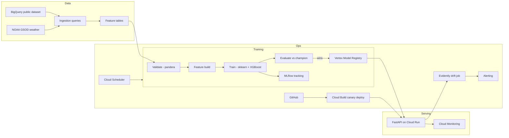

# bikeshare-demand-mlops — Architecture

Related: [PRD.md](PRD.md) · [phases.md](phases.md) · [design.md](design.md)

## Stack

| Layer | Choice |
|---|---|
| Warehouse | BigQuery |
| Orchestration | Vertex AI Pipelines (KFP v2) |
| Experiment tracking | MLflow (SQLite, GCS artifacts) |
| Model registry | Vertex Model Registry (canonical) + MLflow lineage |
| Training model | sklearn Pipeline → XGBRegressor |
| Serving | FastAPI on Cloud Run |
| CI/CD | GitHub → Cloud Build → Artifact Registry → Cloud Run |
| IaC | Terraform |
| Drift monitoring | Evidently in Cloud Run Job |
| Auth GitHub→GCP | Workload Identity Federation |

## System context



## Module map

```
├── terraform/          # GCP resources (Terraform)
├── src/
│   ├── config.py       # Pydantic settings; T_NOW
│   ├── data/           # BQ ingestion, aggregates, pandera schemas
│   ├── features/       # Lags, rolling, calendar, weather, zones
│   ├── train/          # sklearn+XGB pipeline, tuning, MLflow
│   └── serve/          # FastAPI app, model loader, middleware
├── pipelines/          # KFP components and compiled pipeline JSON
├── monitoring/         # Evidently drift job, dashboard configs
├── tests/              # pytest suite
└── notebooks/          # EDA only
```

## Data model

- Raw trips: BigQuery public dataset snapshot.
- Hourly aggregates: `(zone_id, hour_ts, trip_count)`.
- Feature table: `(zone_id, hour_ts, ...features..., trip_count)`.
- Model artifacts: XGBoost + sklearn pipeline saved to GCS.

## Auth

- Public API: no auth, rate-limited per IP.
- Three GCP service accounts: `sa-cicd`, `sa-serving`, `sa-pipeline`.
- GitHub → GCP via Workload Identity Federation; no long-lived JSON keys.

## Deployment

- Cloud Build triggers on push to `main` and on PRs.
- Stages: lint/test, build image, canary deploy at 10%, smoke test, manual promotion.
- Rollback: `make rollback` to previous Cloud Run revision.
- Vertex pipeline runs weekly via Cloud Scheduler.
