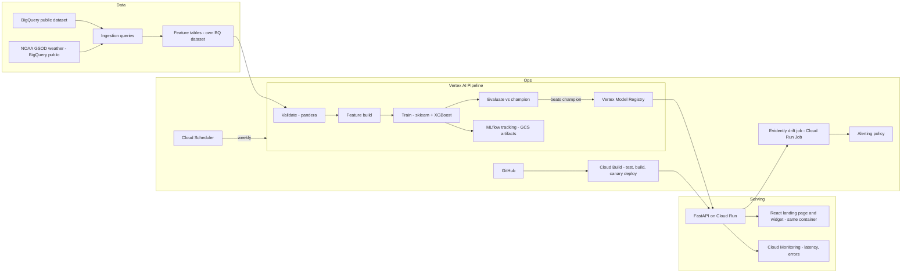

# pedal-cast — Architecture

Production-grade hourly bike-share demand forecasting on GCP.
This document is the source of truth for architecture and decisions. If a proposal contradicts a decision here, stop and ask.

Related: [PRD.md](PRD.md) · [phases.md](phases.md) · [design.md](design.md)

---

## 1. Goal and scope

Moved to [PRD.md](PRD.md), which is the single home for goal, non-goals, and success metrics. In short: predict hourly trip starts per station zone, serve them from a public REST API, and automate train → evaluate → register → deploy → monitor → retrain on GCP.

---

## 2. Dataset decision (Week 0 checkpoint — verify before building)

Candidate BigQuery public datasets:

| Option | Dataset | Max start (queried 2026-08-05) | Notes |
|---|---|---|---|
| A | `bigquery-public-data.london_bicycles` | 2023-01-15 | Large, rich, includes station table |
| B (**chosen**) | `bigquery-public-data.austin_bikeshare` | 2024-06-30 | Freshest; smaller, simpler |
| C | `bigquery-public-data.new_york_citibike` | 2018-05-31 | Well known, but trips table is stale |

**Decision (Gate 0, 2026-08-05):** Austin. Recency wins over London’s richer schema. NYC is too stale to simulate a useful post-`T_NOW` replay window.

| Field | Value |
|---|---|
| Dataset | `bigquery-public-data.austin_bikeshare` |
| Trips / stations | `bikeshare_trips` / `bikeshare_stations` |
| `holidays` country | `US` |
| `T_NOW` | `2024-05-05T00:00:00Z` (~8 weeks before max start, leaves May–June 2024 for drift replay) |
| GCP project | `pedel-504615` |
| Region (for now) | `europe-west2` (Terraform default; revisit at Week 4a) |
| BigQuery dataset location | `US` — a query cannot read `bigquery-public-data` (US multi-region) and write elsewhere, so this one resource ignores the region above (Week 1) |

**Simulated-time design:** define `T_NOW` (config value) inside the data window. Everything downstream treats `T_NOW` as the present: training uses data before it, "incoming production traffic" for drift monitoring is replayed from data after it. This makes drift detection demonstrable with historical data.

---

## 3. Architecture



**Component decisions and reasons:**

| Component | Choice | Why (and why not the alternative) |
|---|---|---|
| Warehouse | BigQuery | Data already lives there (public datasets); free tier covers it. Not Snowflake/Databricks: cost, and no free public-data adjacency. |
| Orchestration | Vertex AI Pipelines (KFP v2) | Anchors the Vertex AI resume claim; managed, pay-per-run. Not Airflow: Composer costs ~$300+/mo idle. |
| Experiment tracking | MLflow, SQLite backend, artifacts in GCS | Free. Hosted MLflow server is cost without portfolio benefit; UI screenshots go in README. |
| Model registry | Vertex Model Registry (canonical) + MLflow runs (lineage) | One canonical registry; MLflow keeps full experiment history. |
| Training model | sklearn Pipeline wrapping XGBoost | Tabular + strong seasonality = gradient boosting territory. Deep learning: worse cost/benefit here, and defending that shows judgment. |
| Serving | FastAPI on Cloud Run | Scale-to-zero, CPU-only, revision-based traffic splitting gives canary for free. Not Vertex Endpoints: always-on node ≈ $60+/mo. |
| Frontend | React + Vite + Tailwind, Three.js via R3F/drei, animate-ui via shadcn CLI, Recharts; Lenis on the 2D fallback only | Interactive city (mouse explore, click landmarks → HUD panels) plus a live prediction widget. Craft inspiration [bruno-simon.com](https://bruno-simon.com/) — not a driveable game; this is an AI/MLOps engineer surface. Recharts via shadcn chart components. Bundle/cold-start cost measured and published. |
| Frontend hosting | Static build served by the same FastAPI container | One image, one deploy, no CORS. Tradeoff and its ceiling recorded in §6. |
| CI/CD | GitHub → Cloud Build → Artifact Registry → Cloud Run | Native GCP path; canary via traffic split. |
| IaC | Terraform | Every GCP resource in code. Clicking around the console is not reproducible and not portfolio-grade. |
| Drift monitoring | Evidently in a Cloud Run Job on a schedule | Free, well-documented, produces HTML reports (README material). Not Vertex Model Monitoring: needs Vertex Endpoints. |
| Auth GitHub→GCP | Workload Identity Federation | No exported JSON service-account keys, ever. |

---

## 4. Data design

**Raw → feature flow:** raw trips → hourly aggregates per **station** → zone rollup in the feature layer → feature table.

The raw layer is deliberately zone-free. Zones are a clustering decision, so keeping them out of ingestion makes re-zoning a feature-layer change rather than a re-ingest. Ingestion materialises zero-demand hours inside each station's own first-to-last observed span, so a quiet hour is a recorded zero and a missing row is a real fault (`assert_hourly_continuity`). Ingestion covers the full history including post-`T_NOW` data, which the drift job replays.

Ingestion validates each table it writes by reading it back through the schemas below, rather than reporting success on a row count. A query that succeeds and returns nothing, or returns a gapped series, is a silent failure that only surfaces later as a bad model. An empty extract is therefore a hard error, not a value. `make ingest-dry-run` is the free pre-flight: it validates the SQL against BigQuery and reports the bytes each extract would bill against the cap, before the paid run.

The raw snapshot bucket is colocated with the dataset in the US, since a BigQuery extract job cannot write to a bucket in another location.

**Target:** `trip_count` per `(zone_id, hour_ts)`.

**Zones:** cluster stations into 10–30 zones (k-means on lat/lon, fit once, persisted). Per-station modeling is sparse and slow; citywide is too coarse to be interesting. Zone count chosen in Week 1 EDA and recorded here.

> **Open (Week 1 finding):** `bigquery-public-data.austin_bikeshare.bikeshare_stations` carries no coordinates. Its columns are `station_id, name, status, address, alternate_name, city_asset_number, property_type, number_of_docks, power_type, footprint_length, footprint_width, notes, council_district, modified_date` — Google's loader drops the latitude and longitude present in the City of Austin source. So k-means on lat/lon needs a coordinate source that is not the BigQuery table. Candidates: snapshot the city's kiosk endpoint (`data.austintexas.gov/resource/qd73-bsdg.json`, ~100 rows, has `location.latitude`/`location.longitude`) into the repo or the raw bucket; or drop k-means and zone by `council_district`, which is already in the table but yields few, unbalanced zones. Decide before the zone step.

**Features (v1):**
- Lags: t-1h, t-24h, t-168h (same hour last week)
- Rolling: 24h and 168h rolling mean/std per zone
- Calendar: hour-of-day, day-of-week, month, is_weekend, is_public_holiday (`holidays` package; country follows the dataset chosen at Gate 0)
- Weather (NOAA GSOD daily join): temp, precipitation, wind — averaged over the GSOD stations within 30 km of downtown Austin, so one station's silent day does not blank the city. Values are converted to Celsius, millimetres, and metres per second at ingestion, and GSOD's out-of-range sentinels (`9999.9`, `99.99`, `999.9`) are nulled rather than averaged in.
- Zone static: zone_id (categorical), station_count per zone

**Leakage rules (hard constraints):**
1. All features for time `t` use only data strictly before `t`.
2. Rolling/lag computation happens after the train/test split boundary logic, never across it.
3. Weather uses same-day *observed* values in v1 — documented simplification (real system would use forecasts); listed in README limitations.

**Splits (time-based, never random):** train = start → T_NOW − 8 weeks; validation = next 4 weeks (tuning + early stopping); test = final 4 weeks before T_NOW (touched once, at the end). Post-T_NOW data is reserved as the replay stream for drift monitoring.

**Validation:** pandera schemas for the raw aggregate and the feature table — types, non-null, value ranges (`trip_count >= 0`, temp bounds), timestamp continuity (no silent gaps). Pipeline fails loudly on violation.

---

## 5. Modeling

**Baselines (mandatory, reported in README):**
1. Seasonal naive: prediction = value at t-168h
2. Simple: value at t-24h

**Model:** `sklearn.pipeline.Pipeline` = ColumnTransformer (ordinal-encode categoricals, passthrough numerics) → `XGBRegressor`. Objective: start with `reg:squarederror`; evaluate `count:poisson` (counts data) and keep whichever wins on validation — record the outcome here.

**Tuning:** randomized search (~30–50 trials) over depth, learning rate, estimators, subsample, colsample, min_child_weight. Every trial logged to MLflow (params, metrics, feature importance plot). No Optuna in v1 (YAGNI); note as stretch.

**Metrics:** MAE (primary — interpretable "trips off per zone-hour"), RMSE, and MAE by segment (peak vs off-peak, weekday vs weekend) to expose where the model is weak. Segment analysis goes in the README.

**Promotion rule (encoded in the pipeline, not a human decision):** challenger replaces champion iff validation MAE improves ≥ 2% AND per-segment MAE degrades nowhere by > 5%. Otherwise pipeline ends with "champion retained" — a logged, visible outcome.

---

## 6. Serving API

FastAPI, versioned prefix `/v1`. Endpoints:

- `POST /v1/predict` — body: `{zone_id, timestamp}` (or batch list); response: `{prediction, model_version, feature_timestamp}`. Pydantic validation on both sides.
- `GET /v1/health` — liveness (200 if up)
- `GET /v1/ready` — readiness (model loaded)
- `GET /v1/metadata` — model version, training date, metrics of deployed model, git SHA

**Model loading:** image is model-free; model artifact pulled from GCS (path = registry entry) at container start, cached in memory. Deploying a new model = new revision with new env var → clean canary semantics.

**Demo surface:** Swagger `/docs` stays enabled in production with example request bodies. It is the API-level demo surface and costs nothing to expose, since the API is public by design.

**Static frontend:** the React build is served by this same service via `StaticFiles`, mounted **last** so `/v1/*` and `/docs` resolve first. A contract test asserts an unknown `/v1` path returns JSON rather than `index.html`.

<!-- One service means frontend commits produce model-style canary revisions,
     softening the clean "a new revision means a new model" semantics above.
     Upgrade path: move the build to its own Cloud Run service or a CDN. -->

Two consequences follow from sharing the service, and both are implemented rather than discovered later:

- Static asset paths are **exempt from rate limiting**, so loading the page does not consume a visitor's prediction budget.
- Static asset paths are **excluded from prediction logging**, so the BigQuery sink used for drift analysis does not fill with asset fetches.

**Feature serving decision (v1):** the service computes calendar features from the request timestamp and reads precomputed lag/rolling features from a small serving table (BigQuery, or GCS parquet loaded at startup — decide by size in Week 4a). Simplification is documented: a real-time system would need an online feature store; that is exactly the Feast stretch goal.

**Hardening:** structured JSON logs (request id, latency, model version, prediction) via a middleware; global exception handler (no stack traces to clients); request size limits; rate limiting (slowapi, per-IP keyed off a correctly parsed `X-Forwarded-For`, since behind Cloud Run `request.client.host` is Google's proxy); security headers on HTML responses; explicit 4xx for out-of-range timestamps or unknown zones.

**Performance target:** p95 < 200 ms warm, measured under a light Locust run against `/v1/predict` specifically (Week 5); publish p50/p95 and cold-start time in README.

---

## 7. Pipelines (Vertex AI, KFP v2)

Components (each a containerized Python function, each unit-testable):
`ingest` → `validate` → `build_features` → `train` → `evaluate` → `register` (conditional) → `notify`

- Pipeline parameters: `T_NOW`, dataset config, tuning trial count, promotion thresholds
- `evaluate` pulls current champion metrics from the registry for comparison
- `register` runs only when the promotion rule passes; uploads to Vertex Model Registry + writes the GCS model path
- `notify` logs the outcome (and optionally posts to a webhook)
- Compiled pipeline JSON checked into the repo; runs triggered by Cloud Scheduler (weekly) or manually via Makefile target
- Retraining trigger v1 is schedule-based; drift-triggered retraining is a documented stretch

---

## 8. CI/CD

**Trigger:** pull request into `main` runs checks; merge to `main` builds and deploys. `main` is branch-protected, so every change arrives by PR.

**Cloud Build stages:**
1. Lint + typecheck + unit tests (`make check`, which covers both Python and the frontend)
2. Build image → push to Artifact Registry, tagged with git SHA
3. Deploy to Cloud Run as new revision at **10% traffic** (canary)
4. Smoke test against the canary revision URL (health + one known-answer prediction)
5. Manual promotion to 100% (`make promote`) — deliberate human gate; auto-promotion on metrics is a documented stretch

**PR trigger security (public repo):** the PR trigger runs under a **test-only service account** with no deploy and no Artifact Registry write, and `--comment-control=COMMENTS_ENABLED` is set explicitly rather than inherited from the default. Anyone can fork a public repo and open a PR editing `cloudbuild.yaml`; this makes that worthless.

**Rollback:** `make rollback` shifts 100% traffic to the previous revision. Tested on purpose in Week 5 (break something, roll back, screenshot it — README material).

**Images:** multi-stage Dockerfile — a Node stage builds `web/` and only `dist/` is copied into the Python runtime stage. Slim base, non-root user, pinned dependencies via lockfile.

---

## 9. Monitoring and observability

- **Service metrics (Cloud Monitoring):** request count, error rate, p50/p95 latency per revision; alerting policy on error rate > 2% (5 min) and p95 > 500 ms (15 min); alerts → email
- **Model logs:** every prediction logged (zone, timestamp, prediction, model version, latency) as structured JSON → available via Logs Explorer / sink to BigQuery for analysis. Static asset requests are excluded.
- **Drift (Evidently, Cloud Run Job, weekly via Scheduler):** reference = training feature distribution; current = replayed post-T_NOW window advancing each week (the simulated-time design makes drift real and demonstrable). Outputs HTML report to GCS + a drift-share metric; alert if drifted-feature share > 30%. Reports are read via signed URL or `gcloud storage cp` — **the bucket is never made public**.
- **Dashboard:** one Cloud Monitoring dashboard (traffic, latency, errors, drift metric); screenshot in README

---

## 10. Security and cost

This is a **public repository**, so the posture below assumes anyone can read the code, read the workflow configuration, and open a pull request.

### 10.1 Identity and access

- Three least-privilege service accounts: `sa-cicd` (build + deploy), `sa-serving` (GCS read, log write), `sa-pipeline` (BigQuery read/write on own dataset, GCS, registry). A fourth, `sa-pr-checks`, runs PR builds with test-only permissions.
- Workload Identity Federation for GitHub → GCP; **no JSON keys in the repo or in GitHub secrets**.
- **The WIF provider carries a strict `attribute_condition`:** `assertion.repository == 'addhumal/pedal-cast'`. Without a condition the provider trusts GitHub's entire issuer, meaning any repository on GitHub can exchange a token for this project — and Terraform applies happily without one. On a public repo the provider path and service account email are both readable in the build configuration, which is all an attacker needs.
- **The IAM binding is the second gate:** `roles/iam.workloadIdentityUser` is granted to a `principalSet` scoped to `attribute.repository/addhumal/pedal-cast`, never to the whole pool. The provider condition decides who may exchange a token; the binding decides who may impersonate. Both, deliberately.
- Verify with `gcloud iam workload-identity-pools providers describe PROVIDER --workload-identity-pool=POOL --location=global --format="value(attributeCondition)"`. **Empty output means vulnerable.**
- Every bucket is private, with uniform bucket-level access and public access prevention enforced.
- No secrets in code or env files committed; Secret Manager if anything secret ever appears (v1 likely has none).
- Public dataset only, no PII; API is unauthenticated by design but rate-limited.

### 10.2 Keeping secrets out of a public repo

- GitHub secret scanning and push protection enabled (free on public repos) — push protection blocks the commit rather than mailing about it afterwards.
- `gitleaks` runs in pre-commit and again in CI.
- `nbstripout` in pre-commit: `notebooks/` explores real trip data, and committed cell outputs are a quiet leak path.
- `main` is branch-protected: pull request required, status checks required, no force-push, no deletion.
- `.gitignore` covers `.env*`, credential JSON patterns, `*.tfstate*`, `mlruns/`, `mlflow.db`, `node_modules/`, `.venv`, `dist/`.

### 10.3 Scanning

- Ruff's `S` ruleset (flake8-bandit) inside the existing lint step — static security analysis with no extra dependency.
- Dependabot on both `uv.lock` and `web/package-lock.json`.
- CodeQL for Python and JavaScript.
- `pip-audit` and `npm audit` wired into `make check`, so a known-vulnerable dependency fails the gate.

### 10.4 Application layer

- Rate limiting keyed off a correctly parsed `X-Forwarded-For`; a naive key function behind Cloud Run sees every visitor as Google's proxy and throttles the whole world as one client. Covered by a test using a forged header.
- Security headers on HTML responses: Content-Security-Policy, `X-Content-Type-Options`, `Referrer-Policy`, `X-Frame-Options`.
- No secrets in `VITE_*` variables — Vite inlines those into the shipped bundle. The frontend receives the API base URL and nothing else.
- Request size limits, and a global exception handler that returns no stack traces.
- Cloud Run max instances 2, bounding both cost and denial-of-service blast radius.
- Cloud Armor is **deferred to a Week 5 decision** (roughly $5–7/month against an under-$10 budget); whichever way it goes is recorded in the README with the price attached.

### 10.5 Cost controls (target < $10/month)

- Billing budget + alert at $15 **before Week 1** (Terraform)
- Cloud Run scale-to-zero, min instances 0, max 2, CPU-only
- BigQuery: `maximum_bytes_billed` set on every job; feature tables partitioned by date
- GCS lifecycle: delete artifacts > 90 days except registered models
- Vertex Pipelines: pay-per-run, small machine types (`e2-standard-4` max)
- Everything torn down with `terraform destroy` if needed; the repo must survive the infra being off (README works standalone)

---

## 11. Testing strategy

| Layer | Tool | What |
|---|---|---|
| Unit | pytest | Feature functions, promotion rule, splits, config parsing |
| Data | pandera | Schema + distribution checks in-pipeline (fail loudly) |
| Pre-flight | BigQuery dry run | `make ingest-dry-run` — SQL validity and bytes billed, before spending anything |
| Model quality | pytest gate | Trained model must beat seasonal naive by ≥ X% on validation, or CI fails |
| API | pytest + httpx | Contract tests: valid/invalid payloads, error shapes, metadata correctness, security headers, route precedence, forged `X-Forwarded-For` |
| Frontend | Vitest | Widget loading, success, empty, and error states; reduced-motion behaviour |
| Integration | local | `make smoke`: build container locally, hit /predict with known input |
| Deploy | Cloud Build step | Post-deploy smoke against canary revision |
| Load | Locust (light) | 10–50 RPS burst against `/v1/predict` for p95 + cold-start numbers (Week 5, run once, publish) |

No task is complete until `make check` passes. Cloud-cost commands (pipeline runs, deploys, BQ queries) are manual.

---

## 12. Repo structure

```
pedal-cast/
├── README.md                  # diagram, metrics table, decisions, demo link
├── LICENSE
├── SECURITY.md
├── Makefile                   # check/check-web/train/smoke/deploy/promote/rollback/pipeline-run
├── pyproject.toml + uv.lock
├── .pre-commit-config.yaml    # gitleaks, nbstripout
├── Dockerfile                 # Node build stage + Python runtime stage
├── cloudbuild.yaml
├── docs/
│   ├── PRD.md                 # product requirements, goal and scope
│   ├── architecture.md        # this file
│   ├── design.md              # UI design system
│   └── phases.md              # week-by-week roadmap
├── terraform/                 # all GCP resources incl. budget alert
├── src/
│   ├── config.py              # pydantic-settings; T_NOW lives here
│   ├── data/                  # BQ ingestion, aggregates, pandera schemas
│   ├── features/              # lags, rolling, calendar, weather join, zones
│   ├── train/                 # sklearn+XGB pipeline, tuning, MLflow, promotion rule
│   └── serve/                 # FastAPI app, model loader, middleware, smoke
├── web/                       # Vite + React landing page and prediction widget
├── pipelines/                 # KFP components + pipeline def + compiled JSON
├── monitoring/                # Evidently job, dashboard + alert configs
├── tests/
└── notebooks/                 # EDA only
```

Process notes and per-week working stubs stay off the public tree.

---

## 13. Week-by-week plan

See [phases.md](phases.md). Each week has a definition of done there.

**Slack policy:** if a week overruns, cut from the stretch list, never from testing or monitoring. Stretch items (documented, not built): Feast, drift-triggered retraining, auto-promotion, Optuna, probabilistic forecasts (quantile loss), moving the frontend to its own service or a CDN.

---

## 14. Failure modes considered

| Failure | Mitigation |
|---|---|
| Public dataset removed/changed | Week-1 raw extract snapshotted to GCS; pipeline reads the snapshot |
| Cost runaway (retry loops, surprise spend) | Budget alert, bytes-billed caps, manual cloud commands, max instances 2 |
| Bad model reaches prod | Promotion rule gate + canary + smoke test + rollback target |
| Silent data quality break | pandera in-pipeline, fails loudly; timestamp continuity check |
| Cold-start latency embarrassment | Measured and published honestly; min-instances=1 costs noted as the fix |
| Model/feature skew | Same feature code path used in training and serving (shared `src/features`) |
| Stranger's PR gains cloud credentials | Test-only PR service account, explicit comment control, WIF pinned to this repo |
| Leaked secret in a public commit | Push protection, gitleaks in pre-commit and CI, notebook output stripping |
