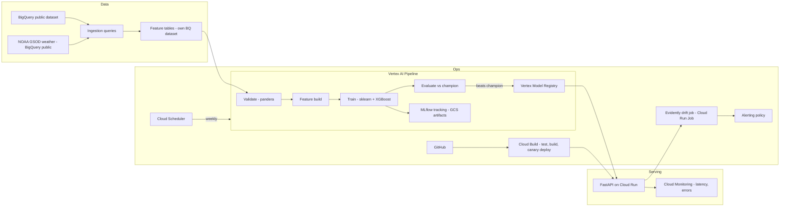

# design.md — bikeshare-demand-mlops

Production-grade hourly bike-share demand forecasting on GCP.
This document is the source of truth for architecture and decisions. Cursor: read this before proposing changes. If a proposal contradicts a decision here, stop and ask.

---

## 1. Goal and scope

**Goal:** Predict hourly bike-share demand (trip starts) per station cluster / zone, served via a public REST API, with a fully automated train → evaluate → register → deploy → monitor → retrain loop on GCP.

**Why it exists (portfolio framing):** Public, pointable evidence of scikit-learn, XGBoost, MLflow, Vertex AI, CI/CD with canary deploys, and drift monitoring — an end-to-end MLOps system, not a notebook.

**Non-goals (v1):**
- No deep learning (XGBoost is the right tool; defend this in README)
- No real-time streaming ingestion (batch hourly/daily is realistic for this problem)
- No feature store (Feast is a documented stretch goal, not v1)
- No GPU anywhere
- No multi-region / HA beyond what Cloud Run gives for free
- No user auth on the API (public demo; rate-limited instead)

---

## 2. Dataset decision (Week 0 checkpoint — verify before building)

Candidate BigQuery public datasets:

| Option | Dataset | Notes |
|---|---|---|
| A (default) | `bigquery-public-data.london_bicycles` | Large, rich, includes station table |
| B | `bigquery-public-data.austin_bikeshare` | Smaller, simpler |
| C | `bigquery-public-data.new_york_citibike` | Well known, but trips table has historically been stale |

**Week 0 task (30 min, before any code):** run `SELECT MAX(start_date) ...` on each candidate. Choose the dataset with the most recent and complete data. Record the choice and the max date here. Staleness is acceptable (we simulate "now" as a cutoff date inside the data window) but must be a *documented, deliberate* choice — the README states the simulation window explicitly.

**Simulated-time design:** define `T_NOW` (config value) inside the data window. Everything downstream treats `T_NOW` as the present: training uses data before it, "incoming production traffic" for drift monitoring is replayed from data after it. This makes drift detection demonstrable with historical data.

---

## 3. Architecture



**Component decisions and reasons:**

| Component | Choice | Why (and why not the alternative) |
|---|---|---|
| Warehouse | BigQuery | Data already lives there (public datasets); free tier covers it. Not Snowflake/Databricks: cost, and no free public-data adjacency. |
| Orchestration | Vertex AI Pipelines (KFP v2) | Anchors the Vertex AI resume claim; managed, pay-per-run. Not Airflow: Composer costs ~$300+/mo idle. |
| Experiment tracking | MLflow, SQLite backend, artifacts in GCS | Free. Hosted MLflow server is cost without portfolio benefit; UI screenshots go in README. |
| Model registry | Vertex Model Registry (canonical) + MLflow runs (lineage) | One canonical registry; MLflow keeps full experiment history. |
| Training model | sklearn Pipeline wrapping XGBoost | Tabular + strong seasonality = gradient boosting territory. Deep learning: worse cost/benefit here, and defending that shows judgment. |
| Serving | FastAPI on Cloud Run | Scale-to-zero, CPU-only, revision-based traffic splitting gives canary for free. Not Vertex Endpoints: always-on node ≈ $60+/mo. |
| CI/CD | GitHub → Cloud Build → Artifact Registry → Cloud Run | Native GCP path; canary via traffic split. |
| IaC | Terraform | Every GCP resource in code. Clicking around the console is not reproducible and not portfolio-grade. |
| Drift monitoring | Evidently in a Cloud Run Job on a schedule | Free, well-documented, produces HTML reports (README material). Not Vertex Model Monitoring: needs Vertex Endpoints. |
| Auth GitHub→GCP | Workload Identity Federation | No exported JSON service-account keys, ever. |

---

## 4. Data design

**Raw → feature flow:** raw trips → hourly aggregates per zone → feature table.

**Target:** `trip_count` per `(zone_id, hour_ts)`.

**Zones:** cluster stations into 10–30 zones (k-means on lat/lon, fit once, persisted). Per-station modeling is sparse and slow; citywide is too coarse to be interesting. Zone count chosen in Week 1 EDA and recorded here.

**Features (v1):**
- Lags: t-1h, t-24h, t-168h (same hour last week)
- Rolling: 24h and 168h rolling mean/std per zone
- Calendar: hour-of-day, day-of-week, month, is_weekend, is_public_holiday (`holidays` package)
- Weather (NOAA GSOD daily join): temp, precipitation, wind
- Zone static: zone_id (categorical), station_count per zone

**Leakage rules (hard constraints):**
1. All features for time `t` use only data strictly before `t`.
2. Rolling/lag computation happens after the train/test split boundary logic, never across it.
3. Weather uses same-day *observed* values in v1 — documented simplification (real system would use forecasts); listed in README limitations.

**Splits (time-based, never random):** train = start → T_NOW − 8 weeks; validation = next 4 weeks (tuning + early stopping); test = final 4 weeks before T_NOW (touched once, at the end). Post-T_NOW data is reserved as the replay stream for drift monitoring.

**Validation:** pandera schemas for the raw aggregate and the feature table — types, non-null, value ranges (`trip_count >= 0`, temp bounds), timestamp continuity (no silent gaps). Pipeline fails loudly on violation.

---

## 5. Modeling

**Baselines (mandatory, reported in README):**
1. Seasonal naive: prediction = value at t-168h
2. Simple: value at t-24h

**Model:** `sklearn.pipeline.Pipeline` = ColumnTransformer (ordinal-encode categoricals, passthrough numerics) → `XGBRegressor`. Objective: start with `reg:squarederror`; evaluate `count:poisson` (counts data) and keep whichever wins on validation — record the outcome here.

**Tuning:** randomized search (~30–50 trials) over depth, learning rate, estimators, subsample, colsample, min_child_weight. Every trial logged to MLflow (params, metrics, feature importance plot). No Optuna in v1 (YAGNI); note as stretch.

**Metrics:** MAE (primary — interpretable "trips off per zone-hour"), RMSE, and MAE by segment (peak vs off-peak, weekday vs weekend) to expose where the model is weak. Segment analysis goes in the README.

**Promotion rule (encoded in the pipeline, not a human decision):** challenger replaces champion iff validation MAE improves ≥ 2% AND per-segment MAE degrades nowhere by > 5%. Otherwise pipeline ends with "champion retained" — a logged, visible outcome.

---

## 6. Serving API

FastAPI, versioned prefix `/v1`. Endpoints:

- `POST /v1/predict` — body: `{zone_id, timestamp}` (or batch list); response: `{prediction, model_version, feature_timestamp}`. Pydantic validation on both sides.
- `GET /v1/health` — liveness (200 if up)
- `GET /v1/ready` — readiness (model loaded)
- `GET /v1/metadata` — model version, training date, metrics of deployed model, git SHA

**Model loading:** image is model-free; model artifact pulled from GCS (path = registry entry) at container start, cached in memory. Deploying a new model = new revision with new env var → clean canary semantics.

**Feature serving decision (v1):** the service computes calendar features from the request timestamp and reads precomputed lag/rolling features from a small serving table (BigQuery, or GCS parquet loaded at startup — decide by size in Week 4). Simplification is documented: a real-time system would need an online feature store; that is exactly the Feast stretch goal.

**Hardening:** structured JSON logs (request id, latency, model version, prediction) via a middleware; global exception handler (no stack traces to clients); request size limits; rate limiting (slowapi, per-IP) since the demo is public; explicit 4xx for out-of-range timestamps or unknown zones.

**Performance target:** p95 < 200 ms warm, measured under a light Locust run (Week 5); publish p50/p95 and cold-start time in README.

---

## 7. Pipelines (Vertex AI, KFP v2)

Components (each a containerized Python function, each unit-testable):
`ingest` → `validate` → `build_features` → `train` → `evaluate` → `register` (conditional) → `notify`

- Pipeline parameters: `T_NOW`, dataset config, tuning trial count, promotion thresholds
- `evaluate` pulls current champion metrics from the registry for comparison
- `register` runs only when the promotion rule passes; uploads to Vertex Model Registry + writes the GCS model path
- `notify` logs the outcome (and optionally posts to a webhook)
- Compiled pipeline JSON checked into the repo; runs triggered by Cloud Scheduler (weekly) or manually via Makefile target
- Retraining trigger v1 is schedule-based; drift-triggered retraining is a documented stretch

---

## 8. CI/CD

**Trigger:** push to `main` (feature branches → PRs; CI runs tests on PRs too via a second trigger).

**Cloud Build stages:**
1. Lint + typecheck + unit tests (`make check`)
2. Build image → push to Artifact Registry, tagged with git SHA
3. Deploy to Cloud Run as new revision at **10% traffic** (canary)
4. Smoke test against the canary revision URL (health + one known-answer prediction)
5. Manual promotion to 100% (`make promote`) — deliberate human gate; auto-promotion on metrics is a documented stretch

**Rollback:** `make rollback` shifts 100% traffic to the previous revision. Tested on purpose in Week 5 (break something, roll back, screenshot it — README material).

**Images:** multi-stage Dockerfile, slim base, non-root user, pinned dependencies via lockfile.

---

## 9. Monitoring and observability

- **Service metrics (Cloud Monitoring):** request count, error rate, p50/p95 latency per revision; alerting policy on error rate > 2% (5 min) and p95 > 500 ms (15 min); alerts → email
- **Model logs:** every prediction logged (zone, timestamp, prediction, model version, latency) as structured JSON → available via Logs Explorer / sink to BigQuery for analysis
- **Drift (Evidently, Cloud Run Job, weekly via Scheduler):** reference = training feature distribution; current = replayed post-T_NOW window advancing each week (the simulated-time design makes drift real and demonstrable). Outputs HTML report to GCS + a drift-share metric; alert if drifted-feature share > 30%
- **Dashboard:** one Cloud Monitoring dashboard (traffic, latency, errors, drift metric); screenshot in README

---

## 10. Security and cost

**Security:**
- Three least-privilege service accounts: `sa-cicd` (build + deploy), `sa-serving` (GCS read, log write), `sa-pipeline` (BigQuery read/write on own dataset, GCS, registry)
- Workload Identity Federation for GitHub → GCP; **no JSON keys in the repo or in GitHub secrets**
- No secrets in code or env files committed; Secret Manager if anything secret ever appears (v1 likely has none)
- Public dataset only, no PII; API is unauthenticated by design but rate-limited

**Cost controls (target < $10/month):**
- Billing budget + alert at $15 **before Week 1** (Terraform)
- Cloud Run scale-to-zero, min instances 0, max 2, CPU-only
- BigQuery: `maximum_bytes_billed` set on every job; feature tables partitioned by date
- GCS lifecycle: delete artifacts > 90 days except registered models
- Vertex Pipelines: pay-per-run, small machine types (`e2-standard-4` max)
- Everything torn down with `terraform destroy` if needed; the repo must survive the infra being off (README works standalone)

---

## 11. Testing strategy

| Layer | Tool | What |
|---|---|---|
| Unit | pytest | Feature functions, promotion rule, splits, config parsing |
| Data | pandera | Schema + distribution checks in-pipeline (fail loudly) |
| Model quality | pytest gate | Trained model must beat seasonal naive by ≥ X% on validation, or CI fails |
| API | pytest + httpx | Contract tests: valid/invalid payloads, error shapes, metadata correctness |
| Integration | local | `make smoke`: build container locally, hit /predict with known input |
| Deploy | Cloud Build step | Post-deploy smoke against canary revision |
| Load | Locust (light) | 10–50 RPS burst for p95 + cold-start numbers (Week 5, run once, publish) |

Agent rule (Cursor): no task is complete until `make check` passes. Cloud-cost commands (pipeline runs, deploys, BQ queries) are human-run only.

---

## 12. Repo structure

```
bikeshare-demand-mlops/
├── README.md                  # diagram, metrics table, decisions, demo link
├── design.md                  # this file
├── tasks.md                   # week-by-week checkboxes
├── memory.md                  # session log
├── Makefile                   # check/train/smoke/deploy/promote/rollback/pipeline-run
├── pyproject.toml + uv.lock
├── Dockerfile
├── cloudbuild.yaml
├── terraform/                 # all GCP resources incl. budget alert
├── src/
│   ├── config.py              # pydantic-settings; T_NOW lives here
│   ├── data/                  # BQ ingestion, aggregates, pandera schemas
│   ├── features/              # lags, rolling, calendar, weather join, zones
│   ├── train/                 # sklearn+XGB pipeline, tuning, MLflow, promotion rule
│   └── serve/                 # FastAPI app, model loader, middleware, smoke
├── pipelines/                 # KFP components + pipeline def + compiled JSON
├── monitoring/                # Evidently job, dashboard + alert configs
├── tests/
└── notebooks/                 # EDA only
```

---

## 13. Week-by-week plan (4–5 h/week) with definitions of done

**Week 0 (1 hour, before anything):** GCP project + billing alert via Terraform; dataset recency check; pick dataset and T_NOW; record both in §2. *Done = budget alert live, dataset chosen.*

**Week 1 — Data + baselines.** Repo scaffold, Cursor rules + spec files, ingestion queries, hourly zone aggregates, pandera schemas, EDA notebook (zone count decision), both baselines with MAE on validation. *Done = `make check` green; baseline numbers written into README table.*

**Week 2 — Features + model + MLflow.** Full feature build with leakage tests, sklearn+XGB pipeline, randomized search logged to MLflow, segment metrics. *Done = model beats seasonal naive on validation; MLflow screenshot saved; promotion rule implemented + unit-tested.*

**Week 3 — Vertex AI pipeline.** Componentize the flow, compile, run end-to-end on Vertex (human-triggered), conditional registration working. *Done = one successful Vertex run visible in console; model in registry; compiled JSON in repo.*

**Week 4 — Serving + CI/CD.** FastAPI service, model loading from GCS, hardening, Dockerfile, Cloud Build with canary deploy + smoke test, WIF auth. *Done = public URL returns predictions; a git push deploys a canary automatically.*

**Week 5 — Monitoring + failure drill.** Evidently drift job + schedule, dashboard, alert policies, Locust run, deliberate bad deploy + `make rollback` (documented with screenshots), weekly retraining schedule. *Done = drift report in GCS; alert fires in a test; rollback proven.*

**Week 6 — Portfolio packaging.** README (Mermaid diagram, metrics table incl. baselines and p95s, decisions/tradeoffs, limitations, cost breakdown), 60-second demo video, agentic-workflow section (how the repo was built with Cursor + where the human gates were), pin repo, LinkedIn post (humaniser voice, no hard metrics in post, link to repo). *Done = a stranger can understand and reproduce the project from the README alone.*

**Slack policy:** if a week overruns, cut from the stretch list, never from testing or monitoring. Stretch items (documented, not built): Feast, drift-triggered retraining, auto-promotion, Optuna, probabilistic forecasts (quantile loss).

---

## 14. Failure modes considered

| Failure | Mitigation |
|---|---|
| Public dataset removed/changed | Week-1 raw extract snapshotted to GCS; pipeline reads the snapshot |
| Cost runaway (agent or retry loop) | Budget alert, bytes-billed caps, human-only cloud commands, max instances 2 |
| Bad model reaches prod | Promotion rule gate + canary + smoke test + rollback target |
| Silent data quality break | pandera in-pipeline, fails loudly; timestamp continuity check |
| Cold-start latency embarrassment | Measured and published honestly; min-instances=1 costs noted as the fix |
| Model/feature skew | Same feature code path used in training and serving (shared `src/features`) |
